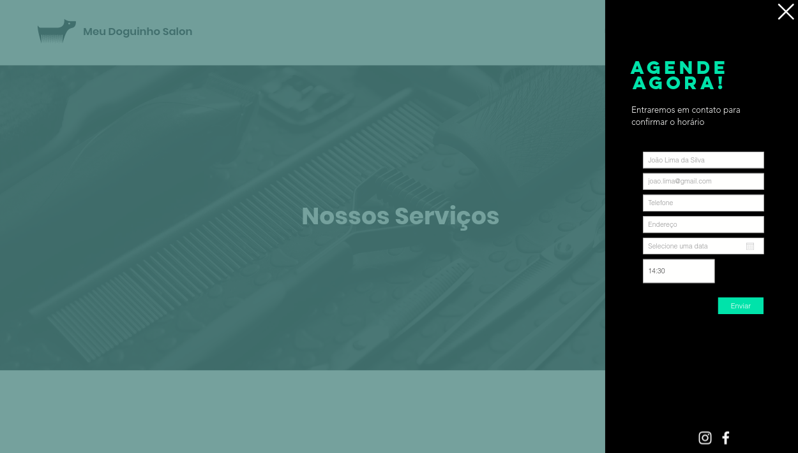

# Prova PHP IST-SD

**Plataforma de Agendamento de Serviços**

Bem vindo, você está para iniciar o Processo Seletivo do Instituto SENAI de Tecnologia em Soluções Digitais. Você deverá avaliar a proposta que preparamos abaixo e procure elaborar uma página com todas as características propostas utilizando-se de seus conhecimentos em HTML, CSS e a Linguagem PHP. 

Alguns pontos em relação ao desenvolvimento:

* Fique a vontade para adicionar bibliotecas e ferramentas externas, caso ache necessário.
* O arquivo de exemplo de conexão com o banco de dados, está no arquivo app/index.php.
* Organize os arquivos do projeto de uma forma adequada (MVC).
* IMPORTANTÍSSIMO: **Você deverá atualizar este readme com as instruções de como o avaliador irá rodar a sua aplicação.**

Você irá se destacar caso:

* Concluir o teste completamente
* Tratar possíveis problemas de segurança
* Utilizar framework Laravel ou Symfony
* Clean Code
* Login com redes sociais
* Criptografia de senha
* Criar o layout responsivo para mobile

Cliente: O PetShop “Meu Doguinho Salon” deseja que seus clientes possam efetuar agendamentos online. Você foi contratado para isso, o design já lhe enviou os mockups das telas.

* Registre-se: O cadastro com redes sociais é opcional.
* Registre-se: A senha no cadastro por e-mail é opcional. 

* A tela de “Nossos Serviços” lista informações que estão armazenadas no banco de dados. Considere duas tabelas Raças e outra Serviços, cada raça poderá contar com uma lista diferente de serviços. Não é necessário criar uma área para administração para cadastro dos serviços. Você poderá popular diretamente no banco de dados.

Entidades
* Atributos Raças: nome
* Atributos Serviços: id_raca, nome, descricao, preco e tempo

* Você não deve permitir o agendamento para usuários não logados
* Quando o usuário estiver logado e clicar em agendar um serviço os campos de nome e e-mail devem vir preenchidos.

## Configuração do Projeto

O projeto utiliza docker para criar um ambiente de desenvolvimento necessário, utilizando **PHP** e **MySql**.

Necessário instalar o docker: https://www.docker.com/get-started

O banco de dados `ist` será criado automaticamente via docker, na hora que subir o projeto. Mas cabe a você a estruturação e criação das demais tabelas, conforme apresentação das telas acima. O script SQL de criação das tabelas necessárias para o projeto, deve ser adicionados no arquivo `db/ist.sql`.

Após o clone do projeto no GitHub, ir via terminal na pasta extraída e executar o comando do docker: `docker-compose up`.

**Atenção:** Se atentar que não pode haver nenhum serviço rodando nas portas `80` e `3306` no computador utilizado para a realização da prova, se tiver, será necessário fechar todos os serviços que utilizam essas portas.

Para verificar se a aplicação subiu corretamento com o docker, digitar no navegador http://localhost/, deverá mostrar uma tela inicial com **Hello World!**, e um exemplo de uma lista com os dados da tabela `pessoas`.

Abaixo os dados para testar a conexão com o banco de dados:
- host: localhost
- port: 3306
- database: ist
- user: root
- password: 123.456

No mais, desenvolva com qualidade e boa prova! :)

